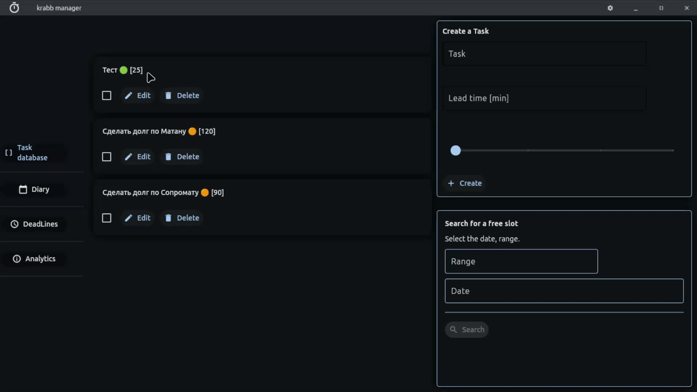

# Krabb Manager

### Time Management App for Students

A simple but powerful desktop application to help students organize their tasks, track deadlines, and never miss important assignments. Created as a school project by a 9th grader.

### ✨ Features

- **Weekly Planner** — schedule tasks for 7 days with importance colors (🟢🟡🟠🔴)
  

- **Smart Slot Finder** — automatically finds free time between existing tasks
  

- **Deadline Tracker** — calendar with color-coded urgency, subtasks support

  
- **Task Database** — store reusable tasks with estimated time

  
- **Eisenhower Matrix** — automatically sorts tasks by urgency/importance

  
- **Notifications** — reminds when it's time to do a task
- **Bilingual UI** — switch between English and Russian

### 🛠 Tech Stack

- Python 3.10+
- [Flet](https://flet.dev/) — modern GUI framework
- JSON for data storage
- Plyer — system notifications

### 📦 Installation
Download `.exe` from [Google Drive](https://drive.google.com/file/d/1Fn7jUoc9cL1ygCZpvVpYhbcrdE1s1JY2/view?usp=drive_link)
or
Download `.exe` from [Yandex Drive](https://disk.yandex.ru/d/4LeHDrJxK0doPg)

### 📊 Why This Project Matters

# This app solves a real problem: many students (including me) struggle with time management. During testing:

    ✅ 15+ classmates used it for a week

    ✅ 2 IT teachers reviewed the code

    ✅ 100% said it helps them organize tasks better

### 📈 Future Plans

    Cloud sync between devices

    Import school timetable

    Mobile version

### 📬 Contact

Created by [xl3pp], 9th grade student
💬 Telegram: @xlpp3

