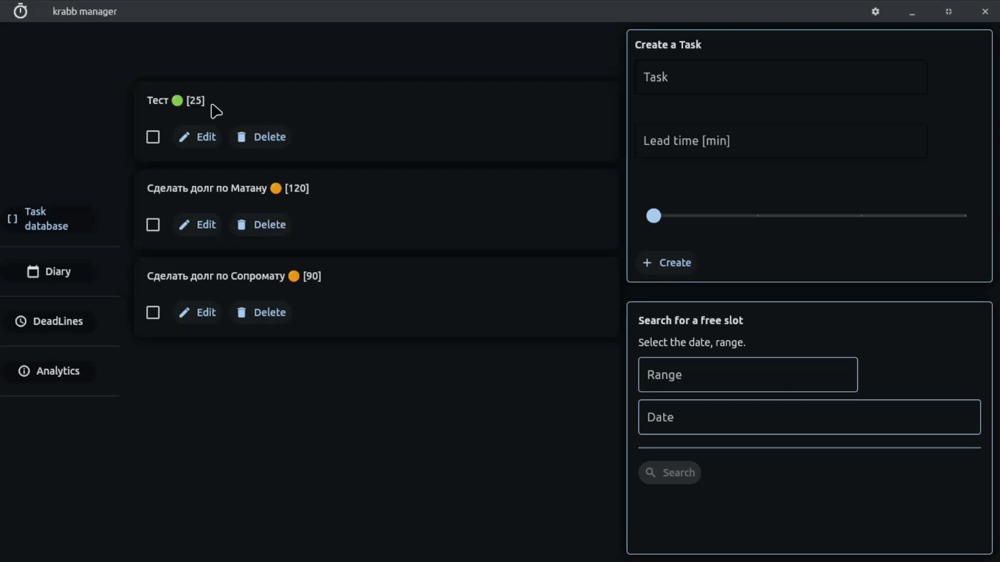

# Krabb Manager

### Time Management App for Students

A simple but powerful desktop application to help students organize their tasks, track deadlines, and never miss important assignments. Created as a school project by a 9th grader.

### ✨ Features

- **Weekly Planner** — schedule tasks for 7 days with importance colors (🟢🟡🟠🔴)
  

- **Smart Slot Finder** — automatically finds free time between existing tasks
  

- **Deadline Tracker** — calendar with color-coded urgency, subtasks support

  
- **Task Database** — store reusable tasks with estimated time

  
- **Eisenhower Matrix** — automatically sorts tasks by urgency/importance

  
- **Notifications** — reminds when it's time to do a task
- **Bilingual UI** — switch between English and Russian

### 🛠 Tech Stack

- Python 3.10+
- [Flet](https://flet.dev/) — modern GUI framework
- JSON for data storage
- Plyer — system notifications

### 📥 Download & Installation

The easiest way to get Krabb Manager is through **GitHub Releases**. Each release includes a ready-to-run `.exe` file — no Python installation required!

#### Option 1: Download from GitHub Releases (Recommended)
1. Go to the **[Releases](https://github.com/xl3pp/Krabb-Manager/releases)** page of this repository
2. Find the latest version (usually at the top)
3. Download `Krabb_Manager_vX.X.X.exe` (or `.zip` archive if available)
4. Run the downloaded file — the app starts immediately!

#### Option 2: Alternative mirrors
- [Google Drive](https://drive.google.com/file/d/1Fn7jUoc9cL1ygCZpvVpYhbcrdE1s1JY2/view?usp=drive_link)

> 💡 **Tip:** Always download the latest version to get newest features and bug fixes!

### ⚠️ Important Security Note

When you first run the downloaded `.exe` file, **Windows SmartScreen** might show a warning:
> *"Windows protected your PC — Microsoft Defender SmartScreen prevented an unrecognized app from starting"*

**This is completely normal** for small independent projects like this one. Here's why:
- The app is **open source** — you can [inspect the code](https://github.com/xl3pp/Krabb-Manager) yourself
- It's not yet digitally signed (code signing certificates are expensive for students 😅)
- The app is 100% safe and contains no malware

#### How to run it safely:
1. When you see the warning, click **"More info"**
2. Then click **"Run anyway"**
3. The app will start normally

✅ **Trust the app?** If you use Krabb Manager regularly, Windows will stop showing this warning after a few launches.

---

### 🐛 Found a bug?
Please [open an issue](https://github.com/xl3pp/Krabb-Manager/issues) — I'm actively maintaining this project!
### 📊 Why This Project Matters

# This app solves a real problem: many students (including me) struggle with time management. During testing:

    ✅ 15+ classmates used it for a week

    ✅ 2 IT teachers reviewed the code

    ✅ 100% said it helps them organize tasks better

### 📈 Future Plans

    Cloud sync between devices

    Import school timetable

    Mobile version

### 📬 Contact

Created by [xl3pp], 9th grade student
💬 Telegram: @xlpp3

